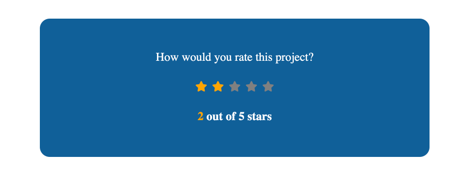

## Learning logs
- Learnd about [react icons library](https://react-icons.github.io/react-icons/) : ` npm i react-icons`
    
    - react-icons is an npm library that contains hundreds of SVG icons that are distributed as React components.

- The useState hook
   
    - The useState() is a Hook that allows to have state variables in functional components.
    - It takes the initial state as an argument and returns an array of two entries (initial state and function that is used for updating the state). 
    - `const [state, setState] = useState(initialstate)`

- Add inline styles to react elements 
    - Ex: `style= {{background:"red"}}`
    
## Star Rating App
 You can see the project [here](https://codesandbox.io/s/star-rating-app-o0047?file=/src/App.js)
   
